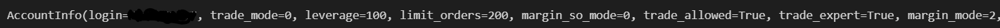

# Gold Trading Bot with MetaTrader5 API


## Introduction
This Python script is a simple trading bot that uses the MetaTrader5 API to trade Gold (XAU/USD) on a demo account.

## Technologies
#### 1. Jupyter Notebook
#### 2. Python 


## Key Features
Here, describe the key features of your project. This section should highlight what makes your project unique and valuable to potential users.

## Installation
Dependencies for this project are: 

- pandas
- numpy
- plotly.express
- scipy.stats
- MetaTrader5
- schedule


## Development

# Trading Bot Algorithm

## Install the libraries in the notebook.

```bash
from datetime import datetime
import time
import pandas as pd
import numpy as np
import plotly.express as px
import MetaTrader5 as mt
import schedule
```

## Initialize time zone and symbol to trade

```bash
mt.initialize(timezone='UTC') # specify the time zone for MetaTrader 5
symbol="XAUUSD"
```

## Login into your MetaTrader account, make sure to create your own account details first.

```bash
login = xxxxxxxxxxx
password ='xxxxxxxxxx'
server = 'MetaQuotes-Demo'
mt.login(login,password,server)

```


## Checking for Null values.

```bash
account_info = mt.account_info()
print(account_info)
```




## Defining important functions for evaluating the stock price.
### calculate_atr(df, period): This function calculates the Average True Range (ATR) of a given DataFrame df using a specified period. It first calculates the True Range (TR) for each row of the DataFrame, which is the maximum of the following three values: (a) high - low, (b) high - previous close, and (c) previous close - low. It then calculates the ATR by taking a rolling mean of the TR values over the specified period.

### atr_trailing_stop(src, atr): This function calculates the trailing stop values using the ATR values obtained from the calculate_atr() function. The src parameter represents the source price data, and the atr parameter represents the ATR values. The function iterates through each row of the data and updates the trailing stop value based on the price movements and ATR values. The function returns a list of trailing stop values.

### ema(close_price): This function calculates the exponential moving average (EMA) of a given price series close_price. The EMA is calculated using a smoothing factor of 1, and the function returns a list of EMA values.

### buy_sell_signals(src, xATRTrailingStop, ema): This function generates buy and sell signals based on the source price data src, the trailing stop values obtained from the atr_trailing_stop() function, and the EMA values obtained from the ema() function. The function compares the price, trailing stop, and EMA values for each row of the data and generates a signal if certain conditions are met. The function returns a list of signals, where a value of 1 represents a buy signal, -1 represents a sell signal, and 0 represents no signal.

```bash
def calculate_atr(df, period):
    true_range = np.maximum(df['high'] - df['low'], df['high'] - df['close'].shift(1), df['close'].shift(1) - df['low'])
    atr = true_range.rolling(window=period).mean()
    return atr

def atr_trailing_stop(src, atr):
    x_atr_trailing_stop = 0.0
    # n_loss = atr * 1
    result = []
    src=src.values
    atr=atr.values
    for i in range(len(src)):
        n_loss = atr[i]
        if i == 0:
            result.append(x_atr_trailing_stop)
        else:
            if src[i] > src[i-1] and src[i-1] > x_atr_trailing_stop:
                x_atr_trailing_stop = max(x_atr_trailing_stop, src[i] - n_loss)
            elif src[i] < src[i-1] and src[i-1] < x_atr_trailing_stop:
                x_atr_trailing_stop = min(x_atr_trailing_stop, src[i] + n_loss)
            elif src[i] > src[i-1]:
                x_atr_trailing_stop = src[i] - n_loss
            else:
                x_atr_trailing_stop = src[i] + n_loss
            result.append(x_atr_trailing_stop)
    return result

def ema(close_price):
    close_price = close_price.values
    ema = close_price[0]
    ema_values = [ema]
    for i in range(1, len(close_price)):
        ema = ema * (1 - 1/1) + close_price[i] * (1/1)
        ema_values.append(ema)
    return ema_values

def buy_sell_signals(src, xATRTrailingStop, ema):
    above_below =''
    res = []
    last_signal = 0;
    for i in range(len(src)):
        # print(i)
        if i !=0:
            
            if (src[i] > xATRTrailingStop[i] and ema[i] > xATRTrailingStop[i] and ema[i-1]<xATRTrailingStop[i-1]):
                above_below = 'above'
                if last_signal!=1:
                    res.append(1)
                    last_signal = 2
                else:
                    res.append(0)
            elif (src[i] < xATRTrailingStop[i] and ema[i] < xATRTrailingStop[i] and ema[i-1]<xATRTrailingStop[i-1]):
                above_below = 'below'
                if last_signal!=-1:
                    res.append(-1)
                    last_signal = -2
                else:
                    res.append(0)
            else:
                res.append(0)
                last_signal = 0
        if i==0:
            res.append(0)
        
    return res
```

## Defining our series, stationarity and displaying our results.

### This function getData() retrieves the historical OHLC (Open, High, Low, Close) data for a given symbol and timeframe using the MetaTrader API. It returns a Pandas DataFrame object containing the retrieved data.

### The function generateSignal(data) takes in the OHLC data as a parameter, and generates a trading signal based on it. It first calculates the ATR (Average True Range) and the trailing stop using the calculate_atr() and atr_trailing_stop() functions respectively. It then calculates the EMA (Exponential Moving Average) using the ema() function. Finally, it generates the buy and sell signals based on the comparison of the closing price, ATR trailing stop, and EMA values using the buy_sell_signals() function. The function returns the last signal generated as an integer (-1 for sell, 0 for hold, 1 for buy).

```bash
def getData():
    symbol = 'XAUUSD'
    timeframe = mt.TIMEFRAME_M1
    current_time = int(time.time())
    data = pd.DataFrame(data = mt.copy_rates_from(symbol, timeframe, current_time+2*60*60,20))
    return data

def generateSignal(data):
    
    atr = calculate_atr(data,10)
    atrSl = atr_trailing_stop(data['close'], atr)
    ema1 = ema(data['close'])
    signals = buy_sell_signals(data['close'].values, atrSl, ema1)
    signal = signals[-1]
    return signal
```

## Defining our Risk Reward Rsatio and percentage of total cash as buy amount.

```bash
RiskRewardRatio = 8
percentage = 0.00031
```

## Creating our monte carlo time series simulations using daily returns from out stocks.

### The trade() function calls two other functions, getData() and generateSignal(), to get the latest market data and generate a trading signal, respectively.

### Then, the code checks if there is an existing open position for the XAUUSD symbol and closes it if it has reached either a -5 or +1 profit level. If there is no open position or the position is closed, the code checks the signal generated by the generateSignal() function and executes a new trade based on the signal.

### If the signal is -1, the code sends a sell order with a stop loss of +5 pips and take profit of -10 pips from the current price, and if the signal is 1, the code sends a buy order with a stop loss of -5 pips and take profit of +10 pips from the current price. The deviation parameter is used to specify the maximum deviation of the requested price from the current market price.

### The magic parameter is used to identify the order from the script, and the comment parameter is used to add an optional comment to the order.

### Finally, the code uses the MetaTrader 5 API to send the order to the broker for execution.

```bash
def trade():
    data = getData()
    signal = generateSignal(data)
    closePrice = data['close'].values[-1]
    high = data['high'].values[-1]
    low = data['low'].values[-1]
    
    position = mt.positions_get(symbol="XAUUSD")
    print(position)
    lastTime = -99999999999
    if (len(position)>0):
        lastTime = position[0].time
        position_id=position[0].ticket
        profit = position[0].profit
        print(profit)
        if profit < -5 or profit >1:
            deviation=20
            if position[0].type ==0:
                request={
            "action": mt.TRADE_ACTION_DEAL,
            "symbol": symbol,
            "volume": 1.0,
            "type": mt.ORDER_TYPE_SELL,
            "position": position_id,
            "price": mt.symbol_info_tick('XAUUSD').bid,
            "deviation": deviation,
            "magic": 234000,
            "comment": "python script close",
            }
                print("Closing Buy")
            else:
                request={
            "action": mt.TRADE_ACTION_DEAL,
            "symbol": symbol,
            "volume": 1.0,
            "type": mt.ORDER_TYPE_BUY,
            "position": position_id,
            "price": mt.symbol_info_tick('XAUUSD').ask,
            "deviation": deviation,
            "magic": 234000,
            "comment": "python script close",
            }
                print("closing sell")
            mt.order_send(request)
    if int(lastTime) - (time.time()+60*60*2)<-60:
        if signal == -1:
            price = mt.symbol_info_tick("XAUUSD").bid
            sl1 =price + 5
            tp1 = price -10
            print(price,sl1,tp1)
            request = {
        "action":mt.TRADE_ACTION_DEAL,
        "symbol":"XAUUSD",
        "volume":1.0,
        "type":mt.ORDER_TYPE_SELL,
        "price": mt.symbol_info_tick("XAUUSD").bid,
        "deviation":20,
        "magic":234000,
        "comment":"",
        "type_time":mt.ORDER_TIME_GTC,
        "type_filling":mt.ORDER_FILLING_IOC,
        }
            print("Sell")
            order = mt.order_send(request)
        
        elif signal == 1:
        
            price = mt.symbol_info_tick("XAUUSD").ask
            sl1 =price -5
            tp1 = price +10
            print(sl1,tp1)
            request = {
        "action":mt.TRADE_ACTION_DEAL,
        "symbol":"XAUUSD",
        "volume":1.0,
        "type":mt.ORDER_TYPE_BUY,
        "price":mt.symbol_info_tick("XAUUSD").ask,
        "deviation":20,
        "magic":234000,
        "comment":"",
        "type_time":mt.ORDER_TIME_GTC,
        "type_filling":mt.ORDER_FILLING_IOC,
        }
            print("Buy")
            order = mt.order_send(request)
           
    
```

## After removing outliers, lets take a look at the profile of the data distribution.

### The first function, trade(), retrieves market data for the XAUUSD symbol using the getData() function and generates a signal using the generateSignal() function. If there is an open position for XAUUSD, it checks if the position's profit is less than -5 or greater than 1. If so, it closes the position by sending a trade request with the opposite direction of the open position using the mt.order_send() function.

### If there is no open position or if the previous one has been closed, the function checks the signal. If the signal is -1, it sends a trade request to sell XAUUSD with a volume of 1.0 using the mt.order_send() function. If the signal is 1, it sends a trade request to buy XAUUSD with a volume of 1.0 using the same function.

### The second function, tradeWithStopLoss(), also retrieves market data and generates a signal. If the signal is -1, it sends a trade request to sell XAUUSD with a volume of 1.0, setting a stop loss price (sl1) at 0.1% above the current bid price and a take profit price (tp1) at 3 times the difference between sl1 and the bid price. If the signal is 1, it sends a trade request to buy XAUUSD with a volume of 1.0, setting a stop loss price (sl1) at 0.1% below the current ask price and a take profit price (tp1) at 3 times the difference between the ask price and sl1.

### Both functions use the mt.order_send() function to send trade requests to the MetaTrader API. They also print some information about the trade that is being executed, such as the signal, the bid or ask price, the stop loss price, and the take profit price.

```bash
def tradeWithStopLoss():
    data = getData()
    signal = generateSignal(data)
    closePrice = data['close'].values[-1]
    high = data['high'].values[-1]
    low = data['low'].values[-1]
    if signal == -1:
        price = mt.symbol_info_tick("XAUUSD").bid
        sl1 = price*1.001
        tp1 = price - (sl1-price)*3
        print(price,sl1,tp1)
        request = {
        "action":mt.TRADE_ACTION_DEAL,
        "symbol":"XAUUSD",
        "volume":1.0,
        "type":mt.ORDER_TYPE_SELL,
        "price": mt.symbol_info_tick("XAUUSD").bid,
        "sl":sl1,
        "tp":tp1,
        "deviation":20,
        "magic":234000,
        "comment":"",
        "type_time":mt.ORDER_TIME_GTC,
        "type_filling":mt.ORDER_FILLING_IOC,
        }
        print("Sell")
        order = mt.order_send(request)
        
    elif signal == 1:
        price = mt.symbol_info_tick("XAUUSD").ask
        sl1 =price*0.999
        tp1 = price+(price-sl1)*3
        print(sl1,tp1)
        request = {
        "action":mt.TRADE_ACTION_DEAL,
        "symbol":"XAUUSD",
        "volume":1.0,
        "type":mt.ORDER_TYPE_BUY,
        "price":mt.symbol_info_tick("XAUUSD").ask,
        "sl":sl1,
        "tp":tp1,
        "deviation":20,
        "magic":234000,
        "comment":"",
        "type_time":mt.ORDER_TIME_GTC,
        "type_filling":mt.ORDER_FILLING_IOC,
        }
        print("Buy")
        order = mt.order_send(request)
           

```

## Lets see the distribution of the log returns.

### This code sets up a scheduling system that executes the trade() function every minute at the start of the minute.

### In the while loop, it checks the current open positions for the XAUUSD symbol. If there is only one position open, the trail_sl() function is called with the ticket of that position to modify its stop loss order. If there are no positions or more than one position open, the trade() function is called to either open a new position or close any existing positions based on the strategy.

### It seems that this code is part of a trading bot or algorithm designed to trade XAUUSD, the symbol for gold in USD, using the MetaTrader platform API. The trail_sl() function probably modifies the stop loss order for a position to trail the price movements of the asset, allowing for potential profits while minimizing losses.

### Note that this code may have limitations and may need to be adjusted for specific trading scenarios or market conditions. It is always recommended to thoroughly test any trading algorithm.

```bash
schedule.every().minute.at(":00").do(trade)
while True:
    positions = mt.positions_get(symbol="XAUUSD")
    if (len(positions)==1):
        trail_sl(positions[0].ticket)
    else:
        trade()
    time.sleep(5)
```


## Conclusion

### Based on the fact that the algorithm has been profitable with a 15% annual return, it suggests that the algorithm is successful in generating consistent profits.The algorithm is focused on trading the XAUUSD (Gold) currency pair using a combination of technical analysis indicators, signal generation, and stop-loss and take-profit levels. The use of a stop-loss is a risk management measure that can help minimize losses in case the trade goes against the expected direction.The algorithm runs on a continuous basis, with a trade executed every minute at the start of the minute, and the positions being checked every 5 seconds. The use of automation can help ensure that trades are executed consistently and without any delay, provided the required trading conditions are met.

### Overall, the success of the algorithm will depend on a variety of factors such as market conditions, volatility, and risk management. It is important to note that past performance is not a guarantee of future results, and there is always a risk of losing money in trading. Therefore, careful monitoring and adjustments to the algorithm may be necessary to ensure continued profitability.
